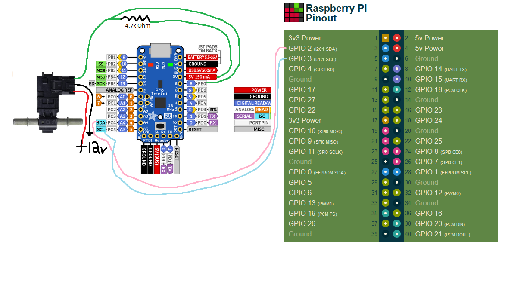

# ethanol-module

Module to read the ethanol percentage of a standard automotive 50hz to 150hz ethanol content sensor

## Description

The goal of this project was to build an affordable way to read ethanol for cars being tuned on e85. The code is built with the purpose of being installed onto an Arduino based device that receives input from an OEM ethanol content sensor.

## Reference

This is a cleaned up example I put together to integrate with a Raspberry Pi and Adafruit Trinket. The original idea and code can be tied back to the user Dala on the [sr20 forums](https://www.sr20-forum.com/nismotronic/76787-flex-fuel-sensor-output.html) and referenced through other various forums from [NASIOC](https://forums.nasioc.com/forums/showthread.php?t=2810122) and [evolutionm](https://www.evolutionm.net/forums/e85-ethanol/734384-e85-gauge-w-output-under-100-a.html). The code was included in snippets across forums and were specific to displaying on an small LCD but this project returns data over [I2C SDA/SCL](https://learn.adafruit.com/introducing-pro-trinket/pinouts) to the Raspberry Pi.

## Usage

An example of interacting with the module using Python and the [smbus-cffi](https://github.com/bivab/smbus-cffi) library.

```python
import smbus
import time

I2C_ADDRESS = 0x04
ETHANOL_DATA_IDENTIFIER = 0x01
DEVICE_DELAY = 0.1

bus = smbus.SMBus(1)

bus.write_byte_data(I2C_ADDRESS,0x00,ETHANOL_DATA_IDENTIFIER)
time.sleep(DEVICE_DELAY)
fuelContent = bus.read_byte(I2C_ADDRESS)
```

The full picture of how this can be implemented and pinned.



Pin out pictures pulled from <https://pinout.xyz> and <https://learn.adafruit.com/introducing-pro-trinket/pinouts>
